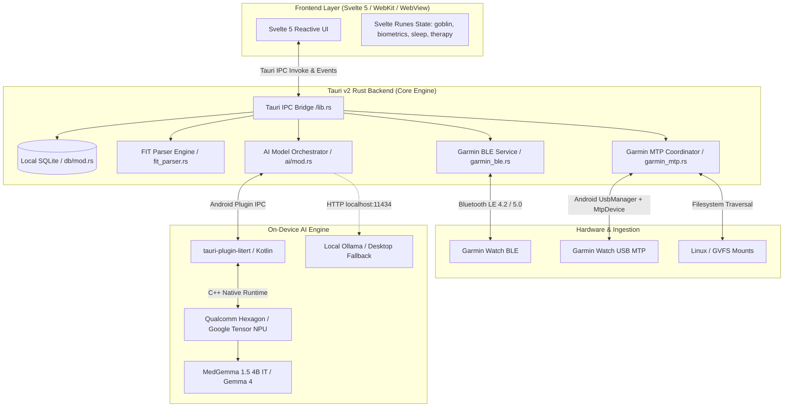

# System Architecture 🏛️

**Garmin Goblin** is built as a local-first, hybrid system combining high-performance native systems programming with modern reactive web interfaces.

The architecture is divided into two primary execution environments:
1. **Frontend (User Interface Layer)**: Built with **Svelte 5** (Runes), SvelteKit, TypeScript, Vite, and Tailwind CSS.
2. **Backend (Core & Systems Layer)**: Built with **Rust**, **Tauri v2**, **SQLite** (`rusqlite`), and custom native Android plugins.

---

## 1. Frontend & IPC Bridge

The frontend communicates with the native Rust backend through Tauri's typed Inter-Process Communication (IPC) invoke interface.

### Key Registered IPC Commands (`src-tauri/src/lib.rs`):
- **Garmin Ingestion**:
  - `scan_ble_devices`, `sync_ble_device`: Background Bluetooth Low Energy pairing and telemetry sync via Gadgetbridge protocol.
  - `scan_usb_mtp_status`: Discovers physical USB connection state and mount points.
  - `request_usb_mtp_permission`: Requests Android USB Host authorization for Garmin vendor IDs (`0x091E`).
  - `sync_garmin_mtp_device`: High-speed bulk extraction of `.FIT` files from the watch filesystem over MTP.
- **Biometrics & RPG Gameplay**:
  - `get_biometrics_today`, `log_biometrics`: Loads or stores heart rate, HRV balance, sleep duration, and stress levels.
  - `get_goblin_state`, `feed_goblin`: Updates Gribble's level, XP, gold, mood, and satiety.
- **On-Device AI & Health Insights**:
  - `generate_ai_chat`: Dispatches user queries with injected workout and recovery context to MedGemma on the NPU or local Ollama.
  - `generate_daily_readiness`: Generates an actionable daily training recovery score.
- **Cognitive Tasks & Breathing**:
  - `save_carit_session`, `save_facename_session`, `save_vismotor_session`: Ingests reaction time and accuracy metrics.
  - `save_therapy_session`: Logs meditation and guided breathing session metrics.

---

## 2. Garmin Dual Ingestion Engine

Garmin Goblin supports two parallel synchronization methods to accommodate different hardware and user scenarios:

### A. Bluetooth Low Energy (BLE)
- Built upon Gadgetbridge reverse-engineered Garmin BLE protocols.
- Handles real-time telemetry streaming: live steps, current heart rate, notifications, and weather broadcasts.
- Runs silently in the background on mobile devices.

### B. High-Speed USB MTP (Media Transfer Protocol)
- **Android**: Custom Kotlin engine using Android's native `android.hardware.usb.UsbManager` and `android.mtp.MtpDevice`. It reads directly from `/GARMIN/ACTIVITY`, `/GARMIN/MONITOR`, and `/GARMIN/SLEEP` storage nodes over USB-C OTG cables.
- **Desktop (Linux/macOS)**: Scans GVFS MTP mount points (`/run/user/$UID/gvfs/mtp:host=*`) and standard block storage.
- **FIT Parser**: Decodes raw binary `.FIT` structures in Rust using custom endianness-aware byte unpacking, extracting GPS trackpoints, cadence, power, heart rate zones, and HRV intervals in milliseconds.

---

## 3. Database Architecture & Linear Migrations

Data persistence is managed via **SQLite** through the `rusqlite` crate, stored in the application's isolated sandbox directory:
- **Android**: `/data/user/0/com.user.garmin_goblin/garmin_goblin.db`
- **Linux**: `~/.local/share/com.user.garmin_goblin/garmin_goblin.db`

Database migrations are versioned via `PRAGMA user_version`. On application startup, `src-tauri/src/db/mod.rs` applies pending migrations atomically:

| Version | Tables Added / Altered | Purpose |
| :--- | :--- | :--- |
| **1** | `users`, `biometrics`, `goblin_state`, `quests` | Core user identity, daily vitals, and RPG state |
| **2** | `activities`, `activity_laps` | Workouts parsed from binary `.FIT` files |
| **3** | `sleep_records`, `sleep_stages` | Detailed hypnogram intervals (Deep, Light, REM, Awake) |
| **4** | `chat_messages`, `ai_insights` | Local conversation history with MedGemma |
| **5** | `carit_results`, `facename_results`, `vismotor_results` | Cognitive test results and reaction times |
| **6** | `therapy_sessions`, `journal_entries` | Guided breathing stats and journal entries |

---

## 4. On-Device AI Acceleration (LiteRT & NPU)

For mobile platforms, AI workloads are offloaded to dedicated hardware accelerators using Google's **LiteRT LM** framework:
1. **Device Runtimes**: Compiled with proprietary JNI bindings for Qualcomm Hexagon NPU (`v69`, `v73`, `v75`, `v79`, `v81`), MediaTek APU, and Google Tensor NPU.
2. **Model Formats**: Utilizes quantized `.litertlm` flatbuffer models (4-bit integer weights with 16-bit activations) for near-instant inference and low thermal footprint.
3. **Desktop Fallback**: Gracefully falls back to local HTTP REST endpoints provided by Ollama (`http://127.0.0.1:11434`) when running on desktop systems.
